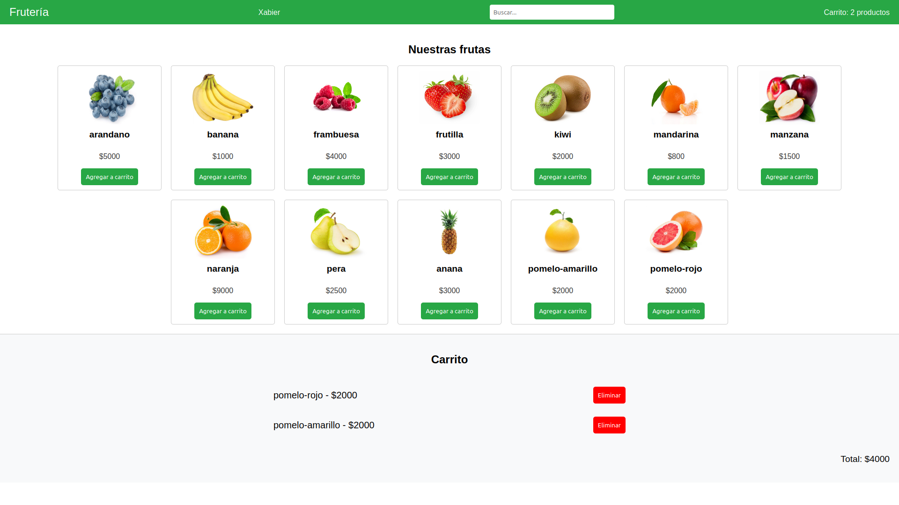

# Parcial Programación III - Tienda de Frutas :apple: :pineapple: :pear: :orange: :watermelon:
Este proyecto consiste en el desarrollo de un frontend para una tienda de frutas.


## Instrucciones del parcial:
- Desarrollá los puntos en el orden indicado.
- Se valorará un código limpio, bien comentado y estructurado.
- Recordá utilizar comentarios para separar bloques de código. 
- Deberán incorporarse comentarios de al menos varias líneas que expliquen de forma sencilla cómo pensamos la resolución del ejercicio y qué decidimos implementar y por qué


## Preguntas:

### Ejercicio 1 _____________  0.5 puntos
Crea un array de objetos con 13 frutas. Cada objeto debe tener las siguientes claves:
- id
- nombre
- precio
- ruta de la imagen (correspondiente a la carpeta img).


### Ejercicio 2 _____________   0.5 puntos
Modifica la función inicializadora `init()` para incluir una función que imprima tu nombre  y apellido en el `<nav>` del HTML y también en la consola.

Pasos:
- Crea un objeto alumno con tus datos (dni, nombre, apellido).
- Usa backticks (``) para mostrar en consola un mensaje que incluya estos datos desde el objeto.
- Imprimí tu nombre y apellido en el `<nav>` y en la consola. 
- Todo esto debe ser parte de la funcion imprimirDatosAlumno()


### Ejercicio 3 _____________   1 punto
Implementa una función que imprima en pantalla los productos (frutas) del array de objetos. Agrega esta función dentro de `init()`.

El HTML generado debe seguir esta estructura:
```html
    <div class="card-producto">
        
        <h3></h3>
        <p>$</p>
        <button>Agregar al carrito</button>
    </div>
```


### Ejercicio 4 _____________   1 punto
Implementar una función de filtro, que se dispare al escribir en un campo input, filtrando los productos que coincidan con el campo de texto.


### Ejercicio 5 _____________   2 puntos
1. Implementar la funcionalidad de carrito, esta debe estar asociada al boton de cada elemento del carrito. El carrito debe mostrarse por `console.log()`

2. Incorporar la funcion `mostrarCarrito()` asociada al boton de cada elemento del carrito
    El HTML generado debe seguir esta estructura:
    ```html
        <li class="bloque-item">
            <p class="nombre-item">nombreProducto - precioProducto</p>
            <button class="boton-eliminar">Eliminar</button>
        </li>
    ```

3. Incorporar la funcion `eliminarProducto()`. Este debe estar asociado al boton del carrito


### Ejercicio 6 _____________   1 punto
- Almacena los productos del carrito en `localStorage`.
- Los productos en el localStorage deben estar además con los últimos cambios de carrito y los productos que se hayan eliminado del carrito
- Si existen productos previamente en el localStorage, deben poder verse cuando se cargue la pagina


### Ejercicio 7 _____________   1 punto
- Implementa un contador de números de productos del carrito. Si hay 0 productos se eliminan del carrito.
- Actualiza la cantidad de productos en el header en la parte de *Carrito: 0 productos*
- Actualiza el precio del valor total del carrito abajo de todo a la derecha (cuando haya productos en el carrito)


### Ejercicio 8 _____________   1 punto
- Crea dos botones en línea con el título de sección productos.
- Implementa la funcionalidad para ordenar los productos en estos dos botones. Un boton debe ordenar por nombre los productos y el otro por precio de menor a mayor


### Ejercicio 9 _____________   0.5 puntos
- Implementa la funcionalidad para Vaciar carrito. Crea un botón en la sección carrito que vacíe todo el carrito.


### Ejercicio 10_____________   1.5 puntos
- Estila la pagina acorde a la imagen (sample.png)

